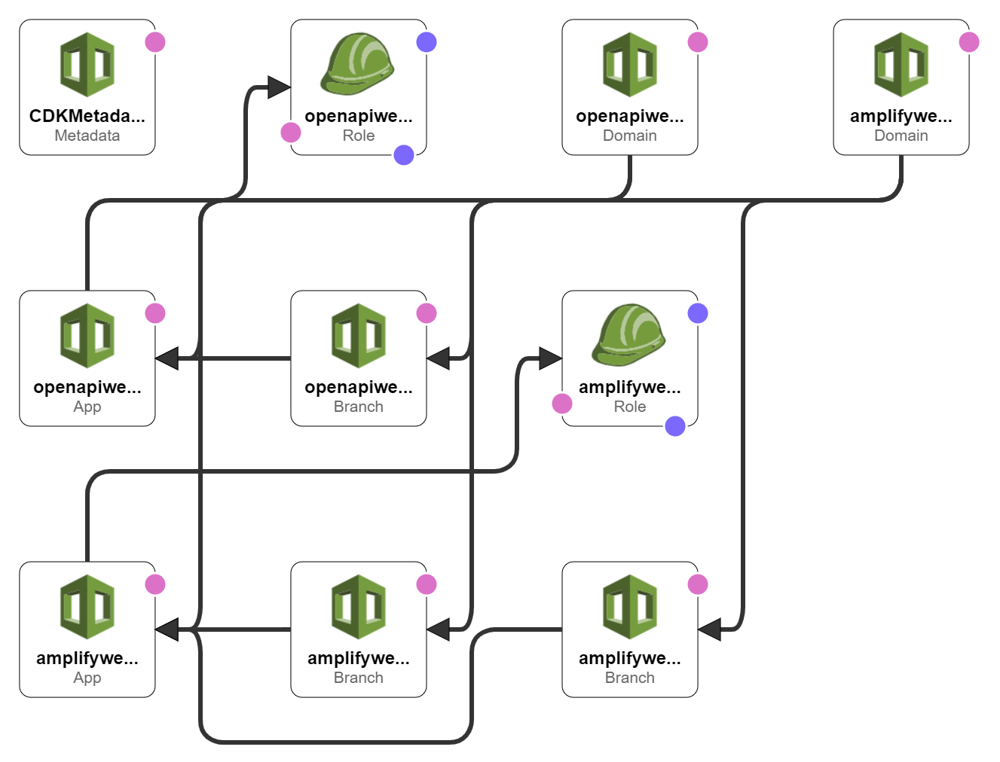

# WasedaTime Backend


This repository defines the serverless application architecture, resource configuration and infrastructure provision strategy of 
[wasedatime.com](https://wasedatime.com).

## About The Project

### Architecture

We adopted a simple serverless application architecture, consisted of four layers: *Presentation Layer*, *Business Layer*, 
*Persistence Layer* and *Admin Layer*.

#### Presentation Layer



#### Business Layer


#### Persistence Layer


#### Admin Layer


## Getting Started

### Prerequisites

This project uses AWS CDK as the IaC Framework. You need to install some modules of aws-cdk.

### Installation

1. Clone the repo
   ```sh
   git clone https://github.com/wasedatime/wasedatime-backend.git
   ```
3. Install NPM packages
   ```sh
   npm install
   ```
4. Obtain a .env file from the administrator and put it into the root directory.

## Usage
The `cdk.json` file tells the CDK Toolkit how to execute your app.

### Useful commands

 * `npm run build`   compile typescript to js
 * `npm run watch`   watch for changes and compile
 * `npm run test`    perform the jest unit tests
 * `cdk deploy`      deploy this stack to your default AWS account/region
 * `cdk diff`        compare deployed stack with current state
 * `cdk synth`       emits the synthesized CloudFormation template
