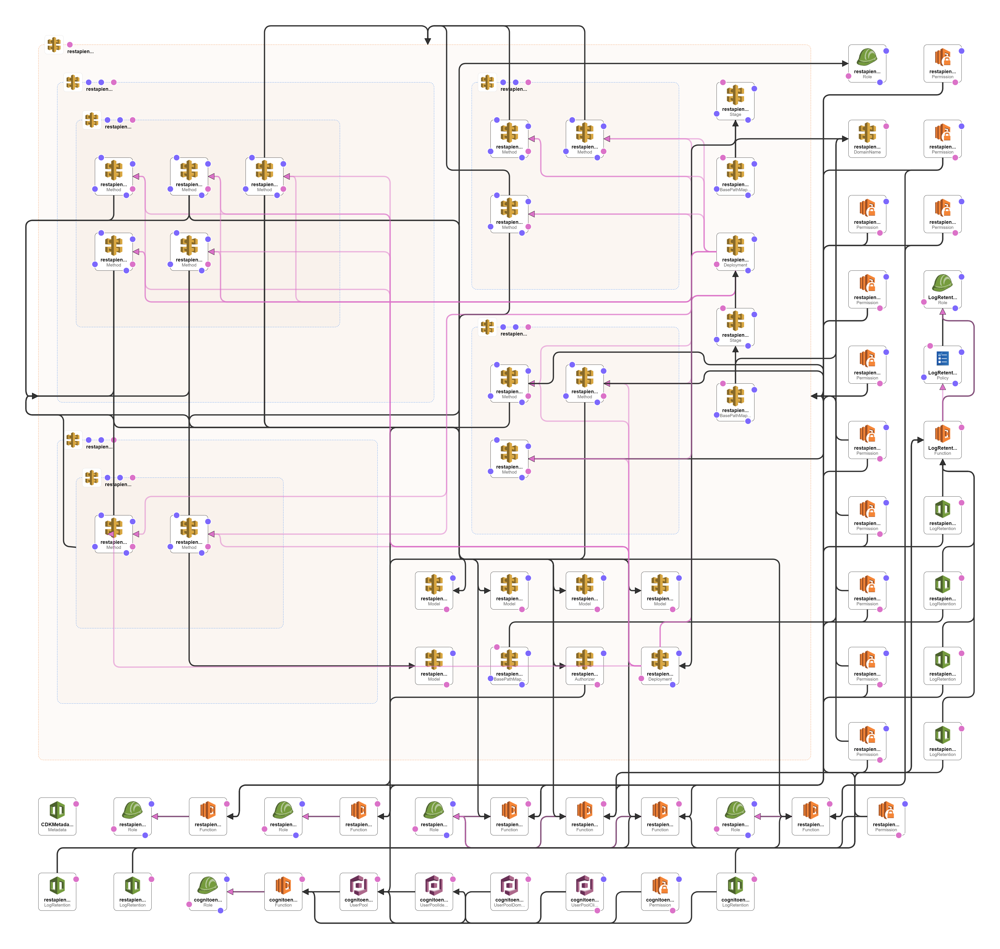
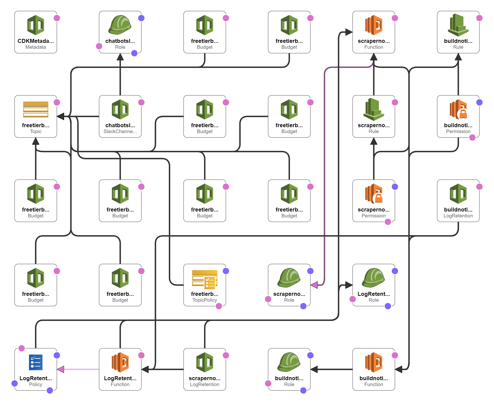

# WasedaTime Backend

This repository defines the serverless application architecture, resource configuration and infrastructure provision strategy of 
[wasedatime.com](https://wasedatime.com).

## Architecture

We adopted a simple serverless application architecture, consisted of four layers: *Presentation Layer*, *Business Layer*, 
*Persistence Layer* and *Admin Layer*.

### Presentation Layer

### Business Layer

### Persistence Layer

### Admin Layer

## CDK Usage
The `cdk.json` file tells the CDK Toolkit how to execute your app.

### Useful commands

 * `npm run build`   compile typescript to js
 * `npm run watch`   watch for changes and compile
 * `npm run test`    perform the jest unit tests
 * `cdk deploy`      deploy this stack to your default AWS account/region
 * `cdk diff`        compare deployed stack with current state
 * `cdk synth`       emits the synthesized CloudFormation template
