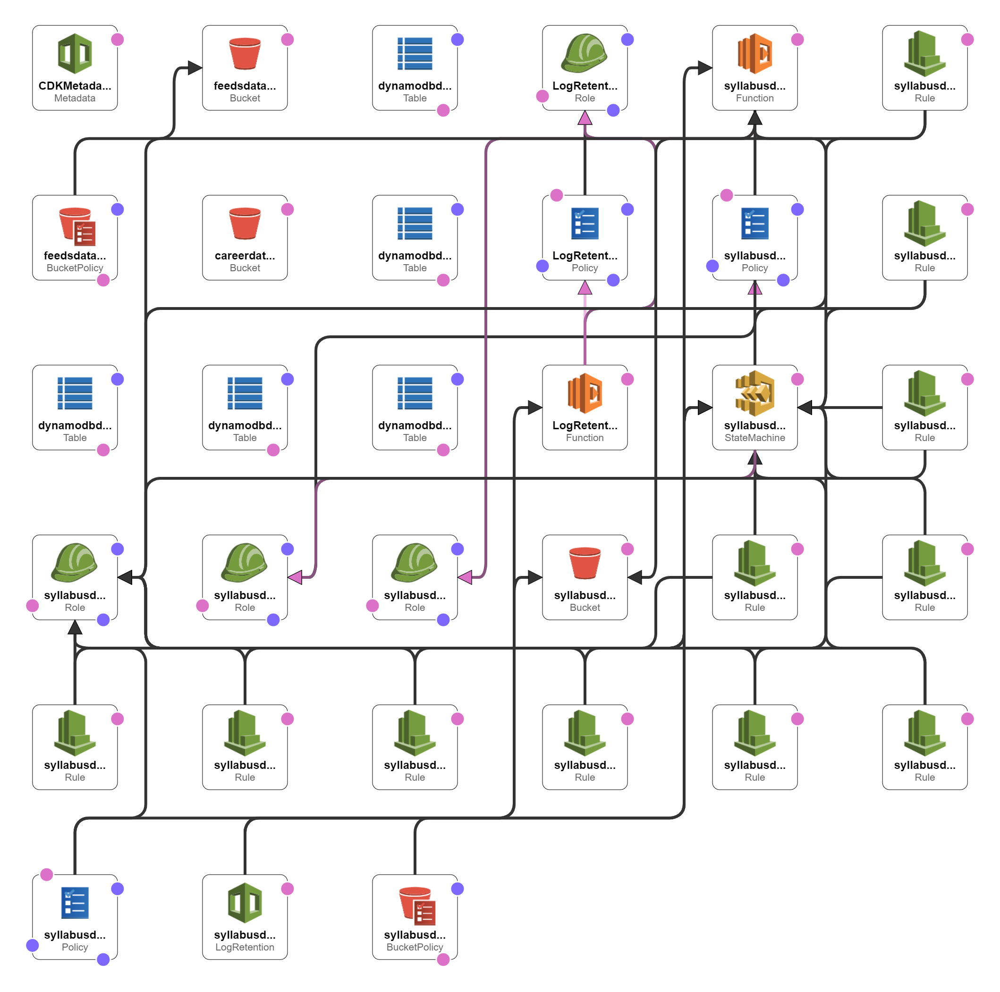

# WasedaTime Backend

[](https://github.com/wasedatime/wasedatime-backend/actions/workflows/deploy.yml)
[](https://app.fossa.com/projects/git%2Bgithub.com%2Fwasedatime%2Fwasedatime-backend?ref=badge_shield)

This repository defines the serverless application architecture, resource configuration and infrastructure provision strategy of 
[wasedatime.com](https://wasedatime.com).

## About The Project

### Architecture

We adopted a simple serverless application architecture, consisted of four layers: *Presentation Layer*, *Business
Layer*,
*Persistence Layer* and *Admin Layer*.

#### Presentation Layer


- Micro-frontends hosting using multiple AWS Amplify Apps.

- Micro-app routing in production environment uses path-based redirect configured through custom rules in AWS Amplify.

- In develop environment, the domain of micro-apps are generated and injected as environment variables into the routing
  table of system-js during build.

- Continuous deployment for each micro-app.

#### Business Layer


- REST API service using AWS API Gateway with Lambda and S3 integration.

- AWS Cognito for user authentication and management.

- GraphQL API server using AWS AppSync

#### Persistence Layer



- AWS DynamoDB as the main database

- S3 stores static data and assets

- Automatic backup is configured for critical tables

- AWS EventBridge executes the scraper using CRON jobs

- Scraper tasks are chained using AWS StepFunctions

- Automated data pipelines triggered by S3

#### Admin Layer


- Integrates AWS Amplify, StepFunctions and CloudFormation status notification into Slack

- AWS Budget plan and alerts

- AWS CloudTrail for operation logging

## Getting Started

### Prerequisites

This project uses AWS CDK as the IaC Framework. You need to install some modules of aws-cdk.

### Installation

1. Clone the repo
   ```sh
   git clone https://github.com/wasedatime/wasedatime-backend.git
   ```
3. Install NPM packages
   ```sh
   npm install
   ```
4. Obtain a .env file from the administrator and put it into the root directory.

## Usage
The `cdk.json` file tells the CDK Toolkit how to execute your app.

### Useful commands

 * `npm run build`   compile typescript to js
 * `npm run watch`   watch for changes and compile
 * `npm run test`    perform the jest unit tests
 * `cdk deploy`      deploy this stack to your default AWS account/region
 * `cdk diff`        compare deployed stack with current state
 * `cdk synth`       emits the synthesized CloudFormation template


## License
[](https://app.fossa.com/projects/git%2Bgithub.com%2Fwasedatime%2Fwasedatime-backend?ref=badge_large)
